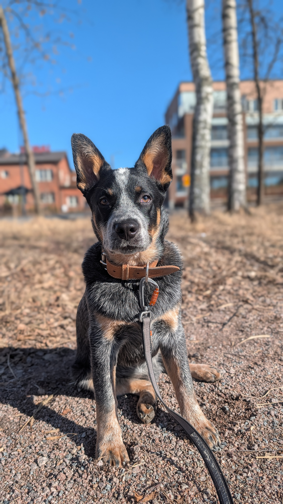

  
  
  # slimmpylk

  **Electrical Engineer Radio Technology & Embedded Systems**  
  Finland 🇫🇮

  

---

## About me

Focus on radio technology and embedded systems. My thesis was a passive RF detection and positioning prototype a coherent dual-channel SDR system with angle-of-arrival estimation and a full geolocation pipeline.

I like building things that touch both hardware and software: firmware that actually runs on silicon, RF systems that decode real signals, and tools that solve real problems. When I'm not doing that, I'm doing canicross with my Blue Heeler **Hati** 🐕 he's the reason half my side projects exist.

Open to opportunities in RF engineering, signal processing, and embedded systems including relocation to different countries

---

## Tech

**RF & Signal Processing**
`Software-Defined Radio` `AoA Estimation` `Geolocation` `RF Measurements` `GNU Radio`

**Embedded & Hardware**
`nRF5340` `STM32` `ESP32` `Zephyr RTOS` `C/C++` `PCB Design` `LilyGO`

**Software & Tools**
`Python` `Robot Framework` `Qt6` `CMake` `Linux` `Git` `C/C++` `REACT` `TYPESCRIPT`

---

## Featured projects

| Repo | What it is |
|---|---|
| [RobotFramework-Nrf5340](https://github.com/slimmpylk/RobotFramework-Nrf5340) | Hardware-in-the-loop test automation for nRF5340 targets |
| [Sport/Smartwatch](https://github.com/slimmpylk/Sport-smartwatch-project) | Homemade sportwatch with PCB design |
| [servo-safe-arduino](https://github.com/slimmpylk/servo-safe-arduino) | Safe servo control library for Arduino |
| [ugreen-mouse-fix](https://github.com/slimmpylk/ugreen-mouse-fix) | Linux fix for UGREEN wireless mouse side buttons — because someone had to |
| [qt-puppycam](https://github.com/slimmpylk/qt-puppycam) | Headless MJPEG webcam streamer in Qt6/C++/V4L2 for Raspberry Pi |
| [sdr-aoa-geolocation](https://urn.fi/URN:NBN:fi:amk-202602213242)  | Coherent dual-channel SDR passive RF positioning system (thesis project) |
| [hati-gps-tracker](https://github.com/slimmpylk/hati-gps-tracker) | DIY GPS tracker for a dog. LilyGO T-A7670E + Traccar + MOLLE harness pouch |

> 🔒 = private repository | contact me if you'd like access

---

## Currently building

- 🐾 **DIY sport/smartwatc** Schematics are almost done and next is PCB designing
- 🔭 Looking for my next RF or embedded role

---

  Hati approves of all pull requests 🐾

